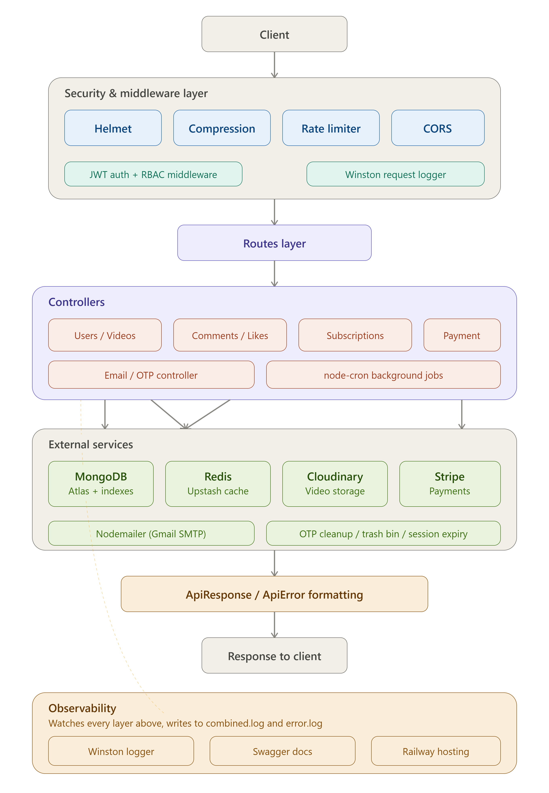

# VideoApp Backend API

A production-level REST API for a YouTube-like video platform, built with Node.js, Express, and MongoDB. This backend powers user authentication, video management, social features, payments, and background automation.

## Live API

**Base URL:** `https://videoapp-backend-production-a823.up.railway.app/api/v1`

**Interactive Docs:** `https://videoapp-backend-production-a823.up.railway.app/api-docs`

## Architecture



Every request flows through Helmet, compression, rate limiting, and CORS before hitting JWT authentication and RBAC. Routes dispatch to controllers, which talk to MongoDB, Redis, Cloudinary, and Stripe. Winston logs every layer to combined.log and error.log, streaming live into Railway in production.

## Tech Stack

- **Runtime:** Node.js, Express.js
- **Database:** MongoDB with Mongoose (aggregation pipelines, pagination, indexing)
- **Caching:** Redis via Upstash
- **File Storage:** Cloudinary
- **Authentication:** JWT (access + refresh tokens), bcrypt
- **Payments:** Stripe
- **Email:** Nodemailer (OTP verification, password reset)
- **Background Jobs:** node-cron
- **Logging:** Winston (structured logs, file + console transports)
- **Testing:** Jest, Supertest (78+ tests)
- **Security:** Helmet, express-rate-limit, RBAC
- **Documentation:** Swagger (OpenAPI 3.0)
- **Deployment:** Railway

## Features

### Authentication & Authorization
- User registration and login with JWT access/refresh tokens
- Role-Based Access Control (User, Creator, Admin)
- OTP email verification and password reset flow
- Secure password hashing with bcrypt

### Video Management
- Full CRUD operations for videos
- Cloudinary integration for video and thumbnail uploads
- Pagination, filtering, sorting, and keyword search
- View count tracking
- Publish/unpublish toggle
- Soft delete (trash bin) system

### Social Features
- Comment system (add, edit, delete)
- Like/unlike videos and comments
- Subscribe/unsubscribe to channels
- Subscriber and subscription analytics

### Performance & Optimization
- Redis caching layer with automatic cache invalidation
- MongoDB compound and text indexes
- Single-pass aggregation queries
- HTTP response compression (gzip/brotli)
- Field-level query optimization with `.select()`

### Background Automation
- Automatic cleanup of expired OTPs and reset tokens
- Soft-deleted video permanent removal after 30 days
- Inactive session expiry
- Scheduled re-engagement detection

### Payments
- Stripe checkout session integration
- Webhook handling for payment confirmation

### Observability
- Winston structured logging across all controllers
- Separate error.log for fast failure diagnosis
- Request logger capturing method, route, status, and response time
- Live log streaming to Railway in production

### Security
- Helmet for HTTP header hardening
- Rate limiting (general + strict auth limiter)
- CORS configuration
- Input validation and sanitization

## API Endpoints

| Resource | Endpoints |
|----------|-----------|
| Users | register, login, logout, refresh-token, update profile, avatar, cover image |
| Videos | CRUD, search, filter, pagination, toggle publish |
| Comments | CRUD with pagination |
| Likes | toggle video/comment likes, get liked videos |
| Subscriptions | subscribe/unsubscribe, get subscribers |
| Email | send OTP, verify OTP, forgot/reset password |
| Payment | create checkout session, webhook |

Full interactive documentation with request/response schemas available at `/api-docs`.

## Testing

```bash
npm test
```

78 tests covering unit logic (OTP generation, response classes, helper functions) and full integration testing (auth flows, video operations, comments, likes, subscriptions, email).

## Environment Variables
MONGODB_URI
PORT
CORS_ORIGIN
ACCESS_TOKEN_SECRET
ACCESS_TOKEN_EXPIRY
REFRESH_TOKEN_SECRET
REFRESH_TOKEN_EXPIRY
CLOUDINARY_CLOUD_NAME
CLOUDINARY_API_KEY
CLOUDINARY_API_SECRET
EMAIL_USER
EMAIL_PASS
FRONTEND_URL
STRIPE_SECRET_KEY
UPSTASH_REDIS_REST_URL
UPSTASH_REDIS_REST_TOKEN

## Local Setup

```bash
git clone https://github.com/Eman-Nazir/videoapp-backend.git
cd videoapp-backend
npm install
cp .env.example .env
# fill in your environment variables
npm run dev
```

## Author

**Eman Nazir**
BS Computer Science, University of Agriculture, Faisalabad
MERN Stack Developer Trainee at ZACoders

Built as part of a 100 Days of Web Development challenge.
